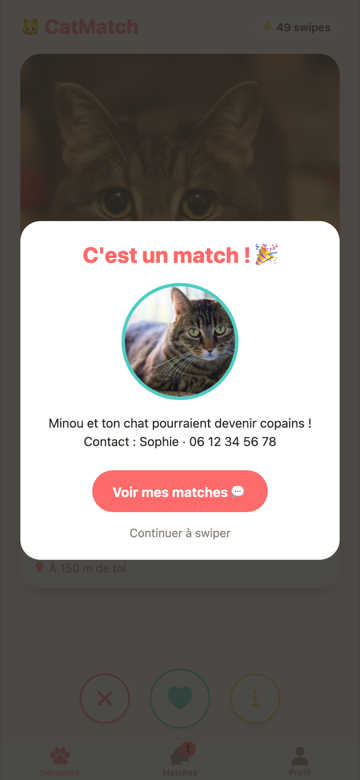
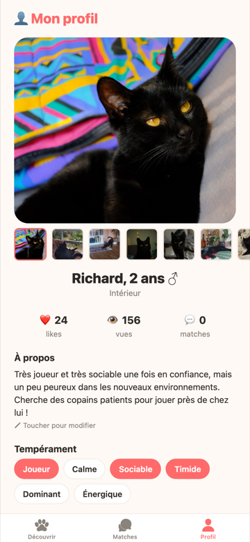
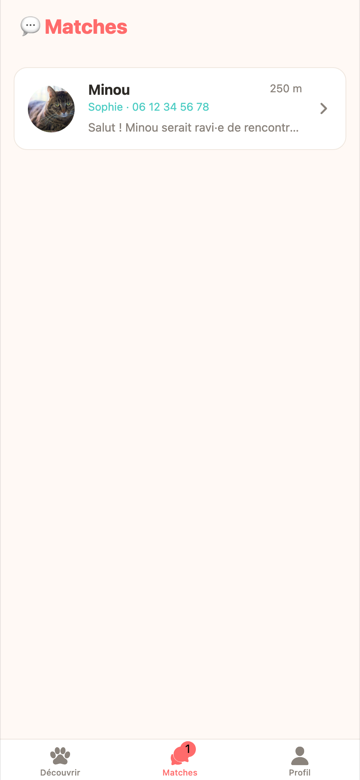
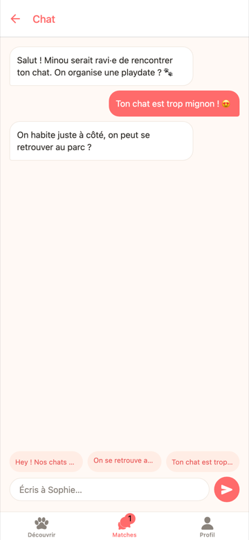

<h1 align="center">🐱 CatMatch</h1>

<p align="center">
  <b>Le Tinder de ton chat.</b><br>
  Trouve-lui des copains de jeu à deux rues d'ici.
</p>

<p align="center">
  <a href="https://romumrn.github.io/CatMatch"><b>👉 Ouvrir l'app (web)</b></a> ·
  <a href="#-installer-et-lancer">Lancer en local</a> ·
  <a href="#-fonctionnalités">Fonctionnalités</a>
</p>

---

## 📱 Sur l'App Store (enfin… presque)

> ### CatMatch — Copains de jeu pour chats
> **Swipe. Match. Ronronne.**
>
> Ton chat tourne en rond dans le salon depuis 14h ? Il a peut-être juste besoin d'un
> pote. **CatMatch**, c'est l'appli qui présente ton chat aux chats du quartier —
> en trois glissements de pouce.
>
> Crée son profil, dis s'il est joueur, calme, dominant ou carrément timide, fixe ton
> rayon de recherche, et laisse-le rencontrer les boules de poils du coin. Quand deux
> chats se plaisent, **c'est un match** : le contact du propriétaire se débloque, et
> vous organisez la playdate entre humains raisonnables.
>
> **Ce que tu peux faire :**
> - 🐾 **Swipe** les chats autour de toi — à droite si ça matche, à gauche si monsieur
>   est trop dominant pour ta petite peureuse
> - 💘 **Match à double like** — personne ne reçoit ton numéro sans que ce soit réciproque
> - 💬 **Chat intégré** avec messages tout prêts pour briser la glace
> - 🎭 **Profil détaillé** — âge, tempérament, intérieur/extérieur, 10 photos, bio
> - 📍 **Rayon réglable** de 300 m à 2 km : les vraies amitiés félines sont de proximité
> - 🔒 **Téléphone masqué** tant qu'il n'y a pas match
>
> Gratuit. 50 swipes par jour. Zéro chat célibataire.
>
> *CatMatch — parce que ton chat mérite mieux que le rideau du salon.*

---

## 📸 Aperçu

<table>
  <tr>
    <td align="center" width="33%"><br><sub><b>Découvrir</b><br>Swipe à droite, swipe à gauche</sub></td>
    <td align="center" width="33%"><br><sub><b>C'est un match !</b><br>Le contact se débloque</sub></td>
    <td align="center" width="33%"><br><sub><b>Profil</b><br>Photos, tempérament, rayon</sub></td>
  </tr>
  <tr>
    <td align="center"><br><sub><b>Matches</b><br>Toutes tes conversations</sub></td>
    <td align="center"><br><sub><b>Chat</b><br>Messages rapides intégrés</sub></td>
    <td align="center"><sub>⭐️⭐️⭐️⭐️⭐️<br><i>« Richard a enfin un pote. »</i><br>— un propriétaire soulagé</sub></td>
  </tr>
</table>

---

## 🚀 Essayer maintenant

**Version web — rien à installer :** [**romumrn.github.io/CatMatch**](https://romumrn.github.io/CatMatch)

Ça s'ouvre directement sur le profil de **Richard**, 2 ans, très joueur, très sociable,
un peu peureux dans les nouveaux environnements. Envoie le lien à tes potes, ils
l'ouvrent dans le navigateur de leur téléphone et c'est parti.

**Sur iPhone / Android en natif :** installe **Expo Go**, lance `npm start`, scanne le QR code.

## 🛠 Installer et lancer

```bash
npm install
npm start          # QR code Expo Go (iPhone/Android)
npm run web        # dev web sur http://localhost:8081
npm run android    # émulateur Android
npm run ios        # simulateur iOS (macOS)
```

## 🌍 Déployer sur GitHub Pages

Le site est un export web statique d'Expo, publié sur la branche `gh-pages`.

```bash
npm run deploy
```

`predeploy` lance `expo export -p web` (sortie dans `dist/`), puis
[scripts/deploy-web.sh](scripts/deploy-web.sh) recopie `dist/` dans un worktree git sur
`gh-pages` et pousse.

Deux pièges que le script neutralise :

- Il crée un fichier **`.nojekyll`**. Sans lui, Jekyll ignore le dossier `_expo/` généré
  par Expo (Jekyll saute tout ce qui commence par `_`) et le bundle JS renvoie 404.
- Il fait un **`git add -f`**. Le `.gitignore` du dépôt contient `node_modules/`, ce qui
  écarterait silencieusement `dist/assets/node_modules/**` — c'est-à-dire toutes les
  polices d'icônes, qui s'afficheraient en carrés vides. C'est exactement ce que fait le
  paquet `gh-pages`, d'où le script maison.

Deux réglages rendent ça possible, dans [app.json](app.json) :

| Réglage | Valeur | Pourquoi |
|---|---|---|
| `experiments.baseUrl` | `/CatMatch` | Le site est servi sous le sous-chemin du repo, pas à la racine du domaine |
| `web.output` | `single` | SPA : un seul `index.html`, la navigation reste côté client |

⚙️ Côté GitHub : **Settings → Pages → Source = Deploy from a branch → `gh-pages` / `(root)`**.

> Si tu renommes le repo, pense à mettre à jour `experiments.baseUrl` **et** `homepage`
> dans [package.json](package.json), sinon les assets pointent dans le vide.

## ✨ Fonctionnalités

- **Découvrir** — deck de swipe façon Tinder (glisser à droite = like, gauche = passe), boutons d'action, tampons animés « J'AIME / PASSE », fiche détaillée du chat (bio, propriétaire), compteur de 50 swipes/jour (version gratuite).
- **Match** — écran « C'est un match ! 🎉 » avec révélation du contact du propriétaire (le téléphone reste caché avant match).
- **Matches** — liste des conversations avec badge sur l'onglet.
- **Chat** — messagerie par match, messages templates rapides, réponse automatique de démo.
- **Profil** — photo principale + galerie (tap pour agrandir), stats (likes/vues/matches), bio éditable, tempéraments et rayon de recherche modifiables, bannière Premium (2,99 €/mois).

Les chats rencontrés sont des **données de démo locales** ([src/data/cats.ts](src/data/cats.ts)) avec photos placecats.com.
Le profil affiché au lancement est celui de Richard, avec de vraies photos dans [assets/richard/](assets/richard/).

## 🗂 Structure

```
App.tsx                      # navigation (3 onglets + stack chat), démarre sur "Profil"
app.json                     # config Expo + export web (baseUrl GitHub Pages)
docs/screenshots/            # captures utilisées dans ce README
scripts/deploy-web.sh        # publication du build sur la branche gh-pages
assets/richard/              # photos de Richard
src/
  theme.ts                   # couleurs / espacements
  types.ts                   # types Cat, Match, Message, profil
  data/cats.ts               # données de démo
  context/AppContext.tsx     # état global (deck, matches, messages, profil)
  components/SwipeDeck.tsx   # cartes swipeables (PanResponder + Animated)
  screens/                   # Discover, Matches, Chat, Profile
```

## 🧭 Prochaines étapes

1. **Firebase** — Auth (SMS), Firestore (profils, matches), Storage (photos/vidéos), Cloud Functions (matching réel à double like).
2. **Géolocalisation réelle** — `expo-location` est déjà installé : remplacer les distances de démo par un geohash + rayon.
3. **Vidéos** — upload 3×30 s, thumbnails, player (expo-video).
4. **Premium** — paywall Stripe / RevenueCat, swipes illimités, « qui t'a liké ».
5. **Modération** — vérification photo (vrai chat), report/block, guidelines.

---

<p align="center"><sub>Fait avec 🐾 · Expo SDK 54 · React Native 0.81 · React 19</sub></p>
