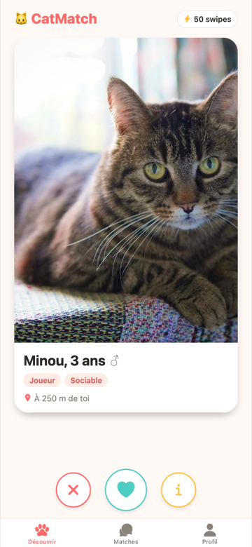
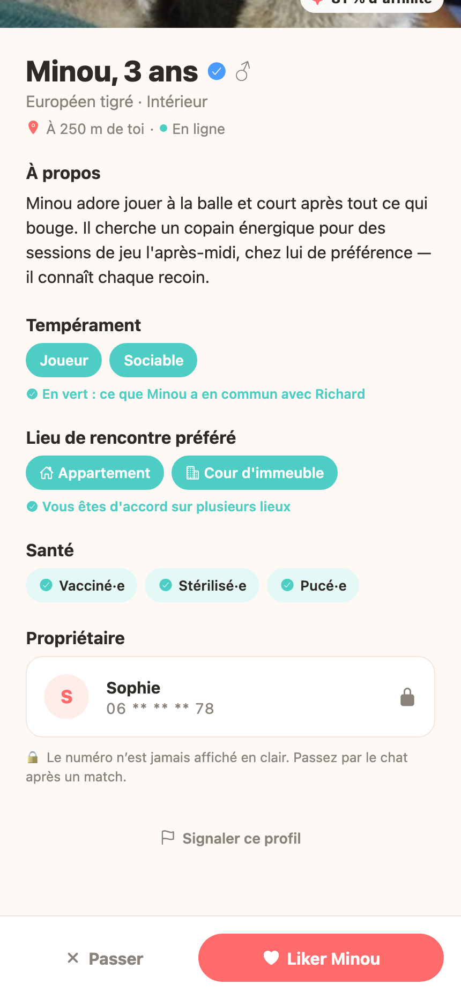
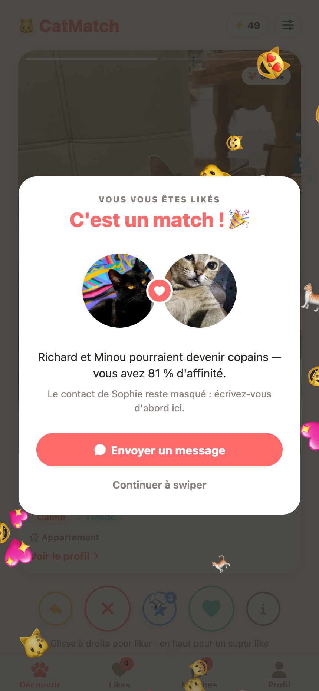
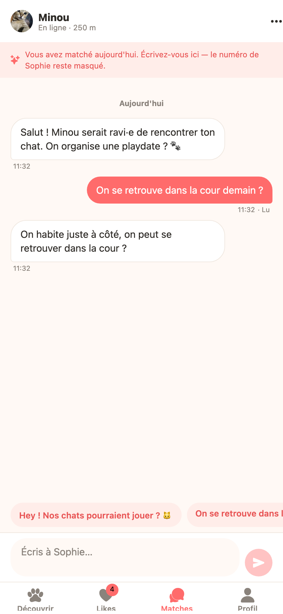
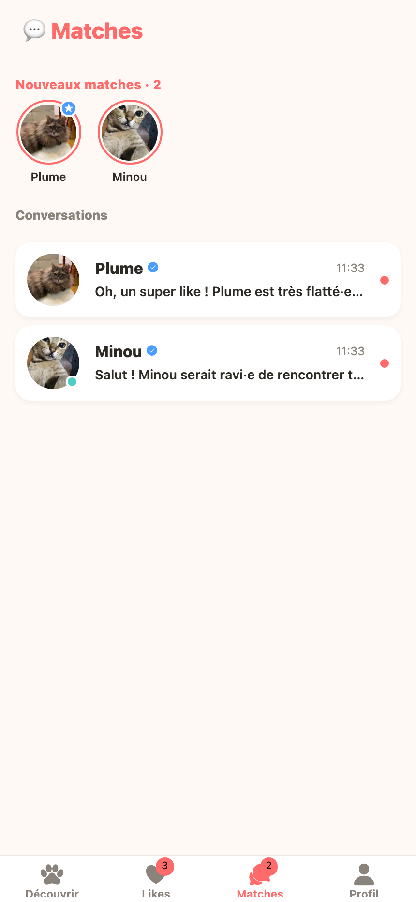
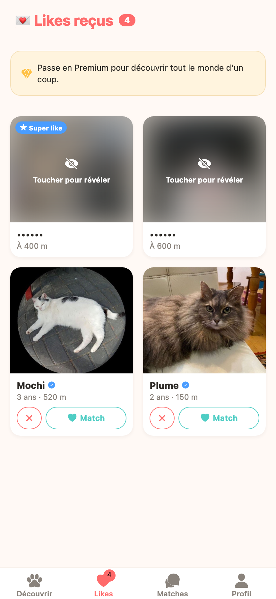
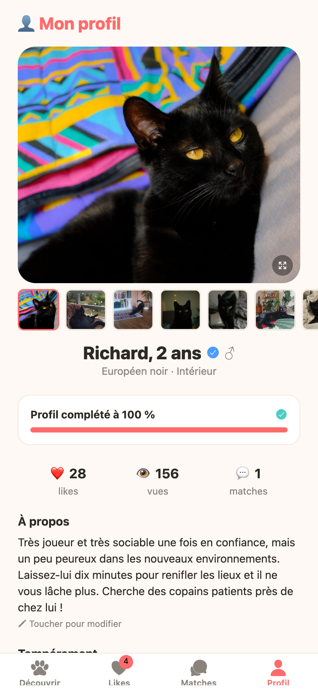
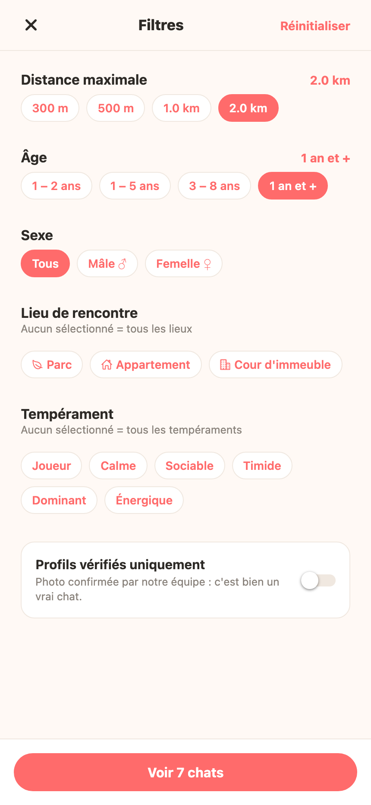

<h1 align="center">🐱 CatMatch</h1>

<p align="center">
  <b>Le Tinder de ton chat.</b><br>
  Trouve-lui des copains de jeu à deux rues d'ici.
</p>

<p align="center">
  <a href="https://romumrn.github.io/CatMatch"><b>👉 Ouvrir l'app (web)</b></a> ·
  <a href="#-installer-et-lancer">Lancer en local</a> ·
  <a href="#-fonctionnalités">Fonctionnalités</a>
</p>

---

## 📱 Sur l'App Store (enfin… presque)

> ### CatMatch — Copains de jeu pour chats
> **Swipe. Match. Ronronne.**
>
> Ton chat tourne en rond dans le salon depuis 14h ? Il a peut-être juste besoin d'un
> pote. **CatMatch**, c'est l'appli qui présente ton chat aux chats du quartier —
> en trois glissements de pouce.
>
> Crée son profil, dis s'il est joueur, calme, dominant ou carrément timide, choisis
> **où il est à l'aise pour rencontrer** — au parc, dans l'appartement ou dans la cour
> de l'immeuble — et laisse-le découvrir les boules de poils du coin. Quand deux chats
> se plaisent, **c'est un match** : la conversation s'ouvre, et vous organisez la
> playdate entre humains raisonnables.
>
> **Ce que tu peux faire :**
> - 🐾 **Swipe** les chats autour de toi — à droite si ça matche, à gauche si monsieur
>   est trop dominant pour ta petite peureuse, vers le haut pour un **super like**
> - ↩️ **Reviens en arrière** si tu as swipé trop vite
> - ✨ **Score d'affinité** calculé sur les tempéraments, le lieu de rencontre et la distance
> - 💘 **Match à double like** — personne ne reçoit ton contact sans que ce soit réciproque
> - 🐈 **Pluie de chats et ronronnement** à chaque match, parce qu'il faut fêter ça
> - 💌 **Vois qui t'a liké** avant même de swiper
> - 💬 **Chat intégré** : accusés de lecture, messages tout prêts, dématcher en un geste
> - 🎭 **Profil détaillé** — âge, race, tempérament, santé (vacciné, stérilisé, pucé),
>   galerie photo, lieu de rencontre préféré
> - 🎚️ **Filtres** : distance, âge, sexe, lieu de rencontre, tempérament, profils vérifiés
> - ✅ **Profils vérifiés** — une vraie photo de vrai chat, confirmée par l'équipe
> - 🔒 **Aucun numéro affiché en clair**, jamais, même après un match
>
> Gratuit. 50 swipes et 3 super likes par jour. Zéro chat célibataire.
>
> *CatMatch — parce que ton chat mérite mieux que le rideau du salon.*

## 📸 Aperçu

<table>
  <tr>
    <td align="center" width="25%"><br><sub><b>Découvrir</b><br>Swipe, super like, retour arrière</sub></td>
    <td align="center" width="25%"><br><sub><b>Fiche profil</b><br>Lieu de rencontre, santé, contact masqué</sub></td>
    <td align="center" width="25%"><br><sub><b>C'est un match !</b><br>Pluie de chats, ronron, score d'affinité</sub></td>
    <td align="center" width="25%"><br><sub><b>Chat</b><br>Accusés de lecture, réponses rapides</sub></td>
  </tr>
  <tr>
    <td align="center"><br><sub><b>Matches</b><br>Nouveaux matches et conversations</sub></td>
    <td align="center"><br><sub><b>Likes reçus</b><br>Floutés jusqu'à ce que tu révèles</sub></td>
    <td align="center"><br><sub><b>Profil</b><br>Galerie, jauge de complétion, santé</sub></td>
    <td align="center"><br><sub><b>Filtres</b><br>Distance, âge, sexe, lieu, tempérament</sub></td>
  </tr>
</table>

> ⭐️⭐️⭐️⭐️⭐️ — *« Richard a enfin un pote. »* — un propriétaire soulagé

## 🚀 Essayer maintenant

**Version web — rien à installer :** [**romumrn.github.io/CatMatch**](https://romumrn.github.io/CatMatch)

Ça s'ouvre directement sur l'écran de swipe, avec le profil de **Richard** — 2 ans,
très joueur, très sociable, un peu peureux dans les nouveaux environnements — déjà en
place dans l'onglet Profil. Envoie le lien à tes potes, ils l'ouvrent dans le navigateur
de leur téléphone et c'est parti.

**Sur iPhone / Android en natif :** installe **Expo Go**, lance `npm start`, scanne le QR code.

## 🛠 Installer et lancer

```bash
npm install
npm start          # QR code Expo Go (iPhone/Android)
npm run web        # dev web sur http://localhost:8081
npm run android    # émulateur Android
npm run ios        # simulateur iOS (macOS)
```

## 🌍 Déployer sur GitHub Pages

Le site est un export web statique d'Expo, publié sur la branche `gh-pages`.

```bash
npm run deploy
```

`predeploy` lance `expo export -p web` (sortie dans `dist/`), puis
[scripts/deploy-web.sh](scripts/deploy-web.sh) recopie `dist/` dans un worktree git sur
`gh-pages` et pousse.

Deux pièges que le script neutralise :

- Il crée un fichier **`.nojekyll`**. Sans lui, Jekyll ignore le dossier `_expo/` généré
  par Expo (Jekyll saute tout ce qui commence par `_`) et le bundle JS renvoie 404.
- Il fait un **`git add -f`**. Le `.gitignore` du dépôt contient `node_modules/`, ce qui
  écarterait silencieusement `dist/assets/node_modules/**` — c'est-à-dire toutes les
  polices d'icônes, qui s'afficheraient en carrés vides. C'est exactement ce que fait le
  paquet `gh-pages`, d'où le script maison.

Deux réglages rendent ça possible, dans [app.json](app.json) :

| Réglage | Valeur | Pourquoi |
|---|---|---|
| `experiments.baseUrl` | `/CatMatch` | Le site est servi sous le sous-chemin du repo, pas à la racine du domaine |
| `web.output` | `single` | SPA : un seul `index.html`, la navigation reste côté client |

⚙️ Côté GitHub : **Settings → Pages → Source = Deploy from a branch → `gh-pages` / `(root)`**.

> Si tu renommes le repo, pense à mettre à jour `experiments.baseUrl` **et** `homepage`
> dans [package.json](package.json), sinon les assets pointent dans le vide.

## ✨ Fonctionnalités

**Découvrir** — deck de swipe façon Tinder : glisser à droite pour liker, à gauche pour
passer, **vers le haut pour un super like**. Carrousel photo sur la carte, tampons animés
« J'AIME / PASSE / SUPER LIKE », **retour arrière** sur le dernier swipe, badge d'affinité,
50 swipes et 3 super likes par jour en version gratuite.

**Filtres** — distance (300 m à 2 km), tranche d'âge, sexe, **lieu de rencontre**,
tempérament, profils vérifiés uniquement. Le nombre de résultats se met à jour en direct.

**Fiche profil** — galerie photo à taps, race, type (intérieur / extérieur / semi-outdoor),
bio, tempéraments et lieux de rencontre **surlignés en vert quand ils correspondent aux
tiens**, santé (vacciné · stérilisé · pucé), propriétaire, signalement.

**Match** — écran de célébration avec les deux photos, score d'affinité, et accès direct
à la conversation. Le match n'a lieu que si le like est réciproque. Une **pluie d'emojis
chats** tombe en fond et un **ronronnement** se déclenche — désactivable depuis le profil.

**Likes reçus** — qui a liké ton chat, photos floutées jusqu'à ce que tu les révèles
(la carotte Premium classique). Liker en retour crée le match immédiatement.

**Matches** — bandeau des nouveaux matches, liste des conversations avec pastille non lu,
indicateur en ligne, heure du dernier message.

**Chat** — séparateurs de date, horodatage, **accusés de lecture**, indicateur « écrit… »,
réponses rapides, en-tête cliquable vers la fiche, **dématcher** depuis le menu.

**Profil** — galerie des photos de Richard avec plein écran, **jauge de complétion** qui
indique la prochaine étape, stats, bio éditable, tempéraments, **lieu de rencontre
préféré**, santé, interrupteur du ronronnement, contact masqué, offre Premium.

### Le lieu de rencontre

Exactement trois choix, pas un de plus : **Parc**, **Appartement**, **Cour d'immeuble**.
C'est un critère de profil, un filtre de recherche, et l'un des trois facteurs du score
d'affinité (tempéraments 50 %, lieux communs 30 %, proximité 20 %).

### La pluie de chats et le ronron

[EmojiRain](src/components/EmojiRain.tsx) fait tomber 34 emojis pendant 5 s, avec taille,
départ, dérive latérale et rotation aléatoires. Une **seule** valeur animée pilote tout le
monde, chaque emoji lisant sa tranche via `interpolate()` : animer 34 valeurs séparées en
JavaScript fait chuter le framerate sur mobile, et `react-native-web` n'a pas de moteur
d'animation natif. La pluie tombe **derrière** la carte pour ne pas gêner la lecture.

Le ronronnement ([assets/sounds/purr.mp3](assets/sounds/purr.mp3), 20 Ko) est **synthétisé**,
pas téléchargé : un vrai ronron est une bouffée de bruit grave répétée ~25 fois par seconde.
Le script génère du bruit blanc passé trois fois dans un filtre passe-bas, le module par un
train d'impulsions à 24–27 Hz avec une cadence qui respire, et y ajoute un corps grave.
Mesuré sur le fichier produit : cadence 25,1 Hz, 96 % de l'énergie sous 300 Hz.

Safari mobile refuse un son qui ne descend pas d'un geste utilisateur. Or un match issu d'un
swipe joue le ronron ~230 ms après le relâchement, dans le callback d'animation — trop tard.
[SoundContext](src/context/SoundContext.tsx) déverrouille donc l'élément audio au tout premier
appui sur la page, dans un vrai gestionnaire de geste.

### Le numéro de téléphone

Il n'est **jamais** affiché en clair, nulle part — ni sur une fiche, ni après un match,
ni sur ton propre profil. Partout où il apparaît, il passe par `maskPhone()`
([src/utils/format.ts](src/utils/format.ts)) qui n'en garde que les deux premiers et les
deux derniers chiffres : `06 ** ** ** 78`. L'échange de coordonnées se fait dans le chat,
entre humains.

### Données de démo

Les 8 chats du quartier vivent dans [src/data/cats.ts](src/data/cats.ts), avec des photos
**embarquées dans le dépôt** ([assets/demo/](assets/demo/)) plutôt que chargées depuis un
service tiers : un lien externe cassé affichait déjà une vignette grise, et le site publié
doit rester autonome. Les photos d'un même profil sont regroupées par robe pour rester
crédibles. Le profil de Richard utilise ses vraies photos ([assets/richard/](assets/richard/)).

L'état (matches, messages, filtres) vit en mémoire : **recharger la page repart de zéro**.
C'est voulu pour une démo — la persistance arrive avec Firebase.

## 🗂 Structure

```
App.tsx                          # navigation (4 onglets + stack chat), démarre sur "Découvrir"
app.json                         # config Expo + export web (baseUrl GitHub Pages)
docs/screenshots/                # captures utilisées dans ce README
scripts/deploy-web.sh            # publication du build sur la branche gh-pages
assets/richard/                  # photos de Richard
assets/demo/                     # photos des chats de démo
assets/sounds/purr.mp3           # ronronnement synthétisé
src/
  theme.ts                       # couleurs, espacements, ombres, largeur max
  types.ts                       # Cat, Match, Message, Filters, MyCatProfile, MeetingPlace
  utils/format.ts                # maskPhone, distances, dates, affinité, filtres, complétion
  data/cats.ts                   # les 8 chats du quartier
  context/AppContext.tsx         # état global (deck filtré, matches, likes reçus, historique)
  components/SwipeDeck.tsx       # cartes swipeables (PanResponder + Animated)
  components/CatDetailSheet.tsx  # fiche profil complète
  components/ui.tsx              # Chip, Section, EmptyState, PrimaryButton, badge vérifié
  components/MatchCelebration.tsx # écran « C'est un match ! » + pluie de chats
  components/EmojiRain.tsx       # pluie d'emojis (une seule valeur animée)
  context/SoundContext.tsx       # ronronnement, interrupteur, déverrouillage audio web
  screens/                       # Discover, Filters, Likes, Matches, Chat, Profile
```

## 🧭 Prochaines étapes

1. **Firebase** — Auth (SMS), Firestore (profils, matches), Storage (photos/vidéos), Cloud Functions (matching réel à double like).
2. **Géolocalisation réelle** — `expo-location` est déjà installé : remplacer les distances de démo par un geohash + rayon.
3. **Vidéos** — upload 3×30 s, thumbnails, player (expo-video).
4. **Premium** — paywall Stripe / RevenueCat, swipes illimités, « qui t'a liké ».
5. **Modération** — vérification photo (vrai chat), report/block, guidelines.

---

<p align="center"><sub>Fait avec 🐾 · Expo SDK 54 · React Native 0.81 · React 19</sub></p>
